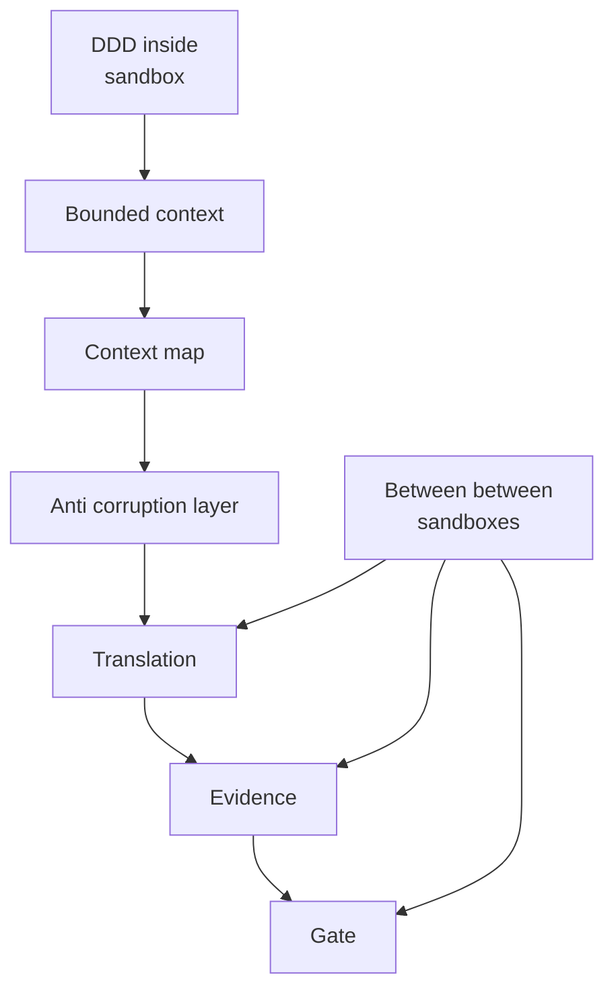

# Reading Technical Bibles: The BOM and the Bounded Context

**Section 1 The BOM Disaster**  
The most dangerous moment in a BOM is when I trust a part number just because it matches. If any of revision, effectivity, substitution rationale, or supplier change is missing, “same part” is no longer a fact. It is a belief. Once that happens, I can no longer separate “a design difference” from “a premise difference,” and the discussion slides into claims about what should be correct. When comparability breaks, agreement itself breaks.

Evans’s book is thick, and its tactical vocabulary is rich. A reader with domain knowledge tends to rush down into the inner patterns and get lost. A reader without domain knowledge cannot even find a foothold in the terms and becomes anxious. That is not a defect so much as the source of the book’s richness: it can be reread many times, and it keeps showing a different face depending on where the reader stands. In this essay I will not evaluate tactics. I will focus only on the boundary conditions under which comparability survives.

I take a domain-side point of view. From the domain side, the software side often looks opaque: where meaning is aligned, where it splits, and what counts as a valid justification when it splits. I read DDD as a framework that makes those invisible decisions speakable—as boundaries and translations.

A BOM failure begins when “boundaries” are folded into the table and become invisible. In an engineering BOM, identity is constrained by functional requirements. In a purchasing BOM, identity is constrained by supply and contract. In a manufacturing BOM, identity is constrained by process and substitution. The same part number may circulate, but the rule that makes it “the same” is not the same.  
This is not “the identity of parts collapsed.” It is closer to “we treated two different bounded contexts as if they were one.” And any boundary crossing should be treated as translation by default, not identity. Strategic Design can be read as the chapter that designs where translation lives, who owns it, and what kind of relationship it represents.

**Section 2 Reading Strategy Skip the Tactics First**  
If I read the BOM failure as a missing condition for comparability rather than a bug in implementation, Strategic Design shows a different face. The strategy is simple: fix the strategic boundary story first, before going down into tactics.

One question is enough. In DDD’s Strategic Design, where are the conditions for comparability established, and where do they break?

**Section 3 Bounded Context as a Comparability Device**  
DDD and Between share the same fear: implicit drift. Words and identity rules have a valid range. Outside that range they drift quietly. A Bounded Context is a device that cuts out a region where meaning does not break. Context Maps and Anti-Corruption Layers assume that connections between such regions do not arise naturally. Boundaries are not evil. They are the unit of order.

The focus differs. If DDD is about building walls to protect internal integrity, Between is about designing the gate in that wall. A gate has crossing conditions. Each crossing triggers translation, leaves evidence, and stops when evidence is missing. Identity across a boundary is not a fact; it is a claim. A claim becomes comparable only when Basis and Evidence are explicit.

Here, a Context Map is not just a connectivity diagram. It is also a map of ownership and power: who adapts to whom, who carries the translation debt, and who absorbs the shock of upstream change. That “translation owner” belongs in the sidecar precisely because the question is political as well as technical.

**Section 4 The Four Questions Reading Method**  
To read Strategic Design as “conditions for comparability,” I only need four questions. They also work as a domain-side review checklist.

- Scope  
    What range is assumed comparable? Where is the boundary?
    
- Translation  
    What changes across the boundary? Is it projection or transformation? Under what conditions may we treat it as “the same”?
    
- Evidence  
    Where does the justification for that claim remain, in a checkable form?
    
- Stop  
    Where do we stop when evidence is missing? If we cannot stop, where will the discussion flow instead?
    

If these four are fixed, the reading path stays stable even as DDD introduces more vocabulary. Going down into tactics can wait until this is in place.

**Section 5 The Boundary Map A Second Lens**  
The four questions give a reading procedure. The boundary map gives a diagnostic lens. It classifies how comparability breaks, and the minimal countermeasure that restores it.

Boundary Map 3×3

| Failure mode \ Action | Declare                                              | Translate                                                         | Stop                                                                         |
| --------------------- | ---------------------------------------------------- | ----------------------------------------------------------------- | ---------------------------------------------------------------------------- |
| Language mismatch     | Declare the term’s scope and basis per contract.     | Provide a glossary mapping per boundary crossing.                 | Gate when the same term has no declared mapping or diverges across contexts. |
| Identity mismatch     | Declare identity rules and their basis per contract. | Treat cross-boundary identity as a claim backed by a mapping ref. | Gate when identity claims lack evidence or mappings are missing.             |
| Invariant mismatch    | Declare invariants and their applicable scope.       | Translate invariants into checkable constraints at the boundary.  | Gate when checks fail or invariants cannot be verified.                      |

How to use it while reading

- Use the four questions to trace the crossing.
    
- Use the boundary map to name what broke (language, identity, invariant) and what to do next (declare, translate, stop).  
    In practice, this map prevents a discussion from collapsing into “it should be correct,” because it forces a concrete diagnosis before arguments begin.
    

**Section 6 The Output Is a Sidecar**  
The output of reading is not a summary. It is a translation sidecar. The contents can stay minimal: contract basis scope, identity claim rule, translation mapping ref, translation owner, check cadence, stop reason mapping. If this is filled, cross-boundary identity is treated as a claim, and when comparability breaks we can return to a design conversation.

On the next pass through DDD, the fastest path is Bounded Context, then Context Map, then Anti-Corruption Layer—while filling this sidecar one line at a time. Even from the domain side, the sidecar makes it visible what is undecided and who must be asked.

**Figure Crossing as a flow**

References  
Eric Evans, Domain-Driven Design (2003), Chapter 2 (Ubiquitous Language), Chapter 14 (Strategic Design)

Next question  
When translation decays in operation, what evidence goes missing first, and where should a gate be placed so that “it should be correct” returns to a design conversation?