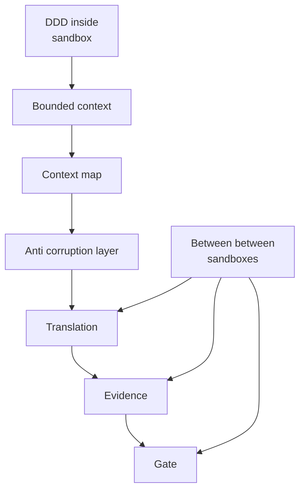

**Reading Technical Bibles The BOM and the Bounded Context**

**Evans「ドメイン駆動設計」：BOMと境界の設計**

**Section 1 BOMの災害**  
BOMで一番危険なのは、部品番号が一致しているという理由だけで同一部品だと信じてしまう瞬間です。版、適用条件、置換の根拠、サプライヤ変更のいずれかが欠けると、同一性は事実ではなく思い込みになります。そうなると、差分が設計差なのか前提差なのかを切り分けられず、議論は正しいはずという主張へ滑ります。比較可能性が壊れると、合意形成そのものが壊れます。

Evansの本は厚く、戦術の語彙が豊富です。ドメイン知識のある読者ほど内側のパターンへ早足で降りて迷子になり、ドメイン知識のない読者は用語に足場がなく不安になります。ただしこれは欠点というより、この本が読み継がれ、読み手の立ち位置によって別の顔を見せる豊かさの源泉でもあります。だから本稿は戦術を評価せず、比較可能性が生き残るための境界条件だけに焦点を当てます。

ここでの視点はソフトウェア側ではなく、ドメイン側です。ドメイン側からは、開発側がどこで意味を揃え、どこで意味が割れ、割れたときに何を根拠として扱うのかが不可視になりやすい。DDDは、その不可視の判断を境界と翻訳として言語化し、会話可能にする枠組みとして読みます。

BOMの事故は、表の中に境界が折り畳まれて見えなくなるところから始まります。設計BOMでは同一性は機能要件で縛られ、購買BOMでは供給と契約で縛られ、製造BOMでは工程と置換で縛られます。同じ部品番号が流通していても、同じとみなす規則は同じとは限りません。  
これは部品の同一性が崩れたというより、異なるBounded Contextを一つとして同一視してしまった状況に近い。そして境界越えは、同一性としてではなくtranslationとして扱うのが既定になる。Strategic Designは、このtranslationがどこに住み、誰が所有し、どんな関係として表現されるかを設計する章として読めます。

**Section 2 読みの戦略 まず戦術を避ける**  
BOMの失敗を実装バグではなく比較可能性の条件欠落として読むと、Strategic Designは別の顔を見せます。戦略は単純で、まず境界の物語を固めてから戦術へ降ります。

問いは一つで足ります。DDDのStrategic Designでは、比較可能性の条件はどこで成立し、どこで破れるのでしょうか。

**Section 3 Bounded Contextは比較可能性の装置**  
DDDとBetweenは同じ恐れを共有しています。暗黙のドリフトです。言葉や同一性の規則には有効範囲があり、その外では静かにズレます。Bounded Contextは、意味が壊れない領域を切り出す装置です。Context MapやAnti Corruption Layerは、そうした領域同士が自然に接続しないことを前提にしています。境界は悪ではなく、秩序の単位です。

ただし焦点が違います。DDDが内側の整合を守るために壁を築くものだとすれば、Betweenはその壁の門を設計します。門には通行条件があり、越境のたびにtranslationが走り、Evidenceが残り、足りなければGateで止まる。境界越えのidentityは事実ではなく主張であり、主張が比較可能になるにはBasisとEvidenceが明示されている必要があります。

さらにContext Mapは、接続図である以上に所有権と力関係の地図でもあります。誰が誰に合わせるのか、translationの負債を誰が持つのか、上流変更の衝撃を誰が吸収するのか。sidecarにtranslation ownerを入れるべき理由は、技術だけでなく政治性にも直結します。

**Section 4 四つの質問という読書メソッド**  
Strategic Designを比較可能性の条件として読むために必要なのは四つの質問だけです。これはドメイン側のレビュー用チェックリストとしても使えます。

- Scope  
    どの範囲を比較可能だと仮定しているか。境界はどこか。
    
- Translation  
    境界越えで何が変わる前提か。projectionかtransformationか。同一視してよい条件は何か。
    
- Evidence  
    その主張を支える根拠は、検査可能な形でどこに残る想定か。
    
- Stop  
    根拠が欠けたとき、どこで止めるのか。止められないなら、議論はどこへ流れ込むのか。
    

この四点が固定されていれば、DDDの語彙が増えても読み筋は崩れません。戦術へ降りるのは、ここが埋まってからで十分です。

**Section 5 境界の地図 もう一つのレンズ**  
四つの質問は手順のレンズです。境界の地図は診断のレンズです。比較可能性がどう壊れたかを分類し、最小の対策を選ぶために使います。

境界の地図 3×3

|壊れ方 対策|Declare|Translate|Stop|
|---|---|---|---|
|Language mismatch|用語のscopeとbasisをcontractごとに宣言する|境界越えごとに用語対応表を与える|対応表がない 同語がズレる場合はGateで止める|
|Identity mismatch|同一性ルールとbasisをcontractごとに宣言する|境界越えの同一性は主張として扱いmapping refで支える|Evidence不足 mapping不在ならGateで止める|
|Invariant mismatch|不変条件と適用範囲を宣言する|不変条件を境界で検査可能な制約へ翻訳する|検査不合格 検証不能ならGateで止める|

読みながらの使い方  
四つの質問で越境をトレースし、境界の地図で何が壊れたかと言語化してから対策を選ぶ。これにより議論が正しいはずへ崩れる前に、診断を先に確定できます。

**Section 6 成果物は要約ではなくsidecar**  
読書の成果物は要約ではありません。translation sidecarです。中身は最小で足ります。contract basis scope、identity claim rule、translation mapping ref、translation owner、check cadence、stop reason mapping。これが埋まっていれば、境界越えの同一性は主張として扱われ、比較可能性が壊れたときも設計会話へ戻れます。

次にDDDを読むなら、Bounded Context、Context Map、Anti Corruption Layerの順に、sidecarを一行ずつ埋めていくのが最短です。ドメイン側からでも、未決事項と確認先が見えるようになります。

**Figure Crossing as a flow**

参考  
Eric Evans Domain Driven Design 2003 Chapter 2 Ubiquitous Language Chapter 14 Strategic Design

次に持ち越す問い  
translationが運用で劣化するとき、最初に欠けるEvidenceは何で、どこにGateを置けば正しいはずを設計会話へ戻せるでしょうか。

用語ミニ表

|JP|EN|
|---|---|
|境界づけられた文脈|Bounded context|
|文脈間関係|Context map|
|腐食防止層|Anti corruption layer|
|翻訳|Translation|
|証跡|Evidence|
|停止点|Gate|
|基底|Basis|
|壊れ方|Failure mode|
|対策|Action|